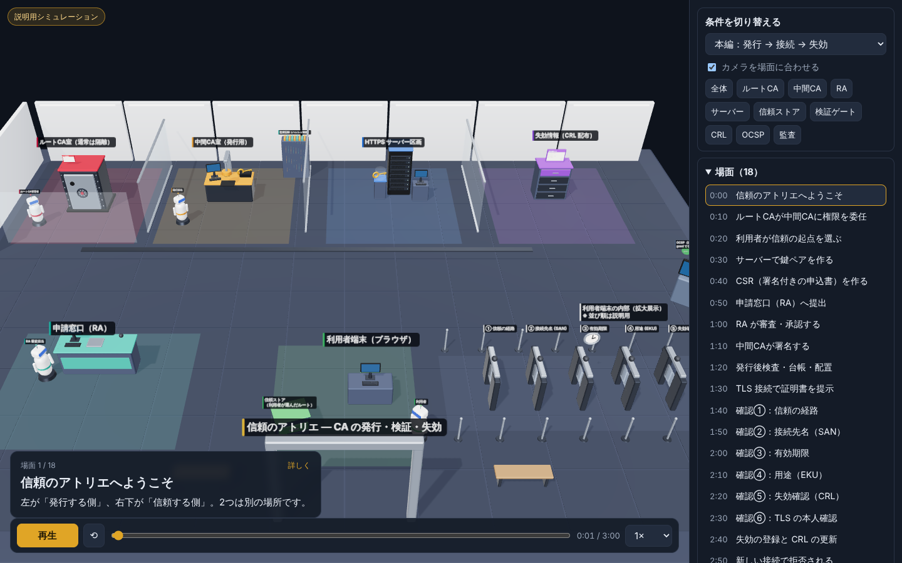
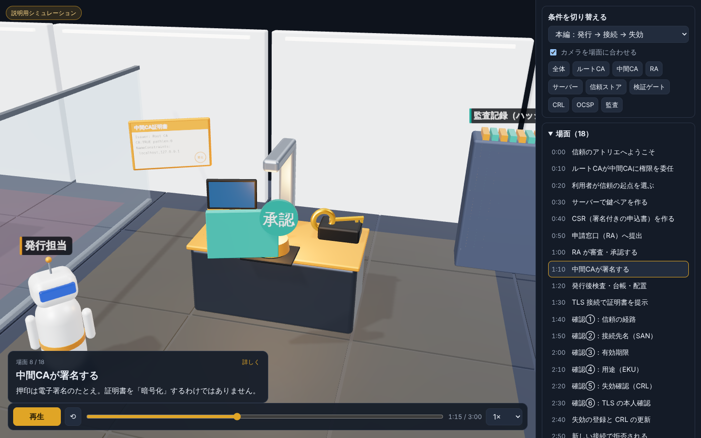
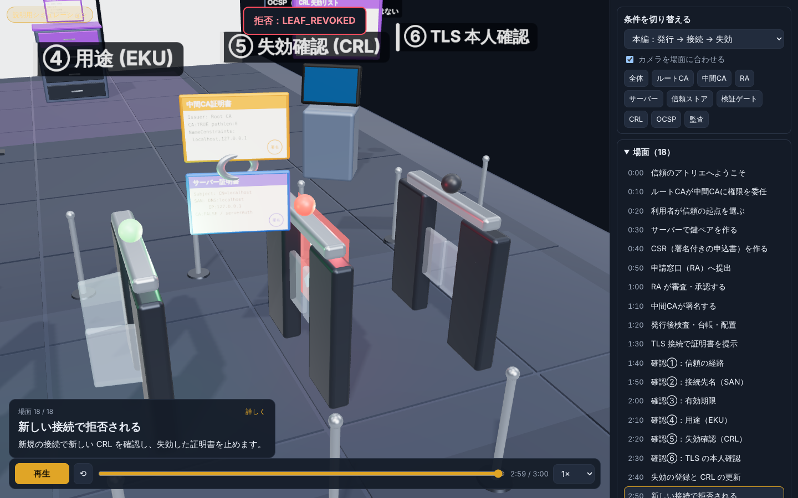

# 自分だけの認証局（CA）を作って、3Dアニメにしてみた

最近、「自分だけの認証局（CA）を作ってみる」という実験をしていました。

ルートCAを作って、中間CAから証明書を発行して、ローカルの HTTPS 通信で本当に信頼されるのかを確かめる ― というものです。最終的には、その仕組みを **three.js の3Dアニメーション**にまでしてみました。



詳しい手順と設計は、解説ページにまとめています。

- [自分だけの認証局（CA）を設計する ― 要件定義・基本設計・詳細設計](/awslearn/practical/private-ca-design/)
- [証明書の発行・検証・失効を three.js の3Dアニメで見る](/awslearn/practical/ca-3d-visualization/)

この記事では、作りながら考えたことを書いておきます。

---

## 「発行できる」と「信頼される」は別だった

OpenSSL を使えば、証明書は誰でも作れます。最初はそれだけで「CA ができた！」と思っていました。

でも、自作のルートCAを信頼させずに curl で接続すると、当然エラーになります。

```
curl: (60) SSL certificate problem: unable to get local issuer certificate
```

証明書を信じるかどうかを決めるのは、**作った側ではなく、検証する側**なんですよね。RFC 5280 でも、信頼の起点（トラストアンカー）は検証者が持つものとして扱われています。

なので、今回は OS の信頼ストアには登録せず、`--cacert` で「この実験のときだけ」信頼させる方法にしました。自作CAのルートを OS に登録すると、そのCAが発行した**どんなドメインの証明書でも**PC全体が信じてしまうので、気軽にやるのは危ないです。

---

## いちばん驚いたのは「失効しても接続できる」こと

証明書を失効させて、CRL（失効リスト）も作りました。これで接続できなくなるはず……と思ったら、curl では普通につながりました。

```
$ curl --cacert root.cert.pem https://localhost:8443/
Hello from PKI Lab over TLS     ← 失効済みなのに接続できる
```

curl は、既定では CRL を確認しないからです。`--crlfile` を付けると、ちゃんと拒否されます。

```
$ curl --cacert root.cert.pem --crlfile intermediate.crl.pem https://localhost:8443/
curl: (60) SSL certificate problem: certificate revoked
```

つまり失効は、

1. CA が失効を**登録**する
2. CRL を**配布**する
3. 利用者が**確認**する

の3つがそろって初めて効きます。CA 側で作業しただけでは足りない、というのが今回いちばんの学びでした。

---

## SNS で見かけた説明について

調べている途中で、SNS で少し気になる説明を見かけたので整理しておきます。

**「Let's Encrypt は無料だから信頼性が低い」**
→ これは誤りです。Let's Encrypt は主要な OS やブラウザの信頼ストアに入っている、正式な公開認証局です。無料なのは自動化と非営利の運営によるものです。

**「自作CAでマイナンバーカードの電子証明書の代わりになる」**
→ なりません。公的個人認証は、制度に基づく本人確認や失効管理の仕組みの上に成り立っています。同じ形式の証明書が作れても、誰もそれを信頼の起点にしていないので、代わりにはなりません。

**「自作CAを OS に登録すれば便利」**
→ 上で書いたとおり、危険です。

---

## ちゃんと「設計」してみた

最初の実験キットは「とりあえず動かす」ものでした。でも見直すと、

- ルートCAと中間CAの鍵が同じ場所にある
- 申請の審査や承認がない
- 同時に発行したときや、途中で止まったときのことを考えていない
- CRL を作っただけで、配布や鮮度の確認がない

と、足りないところだらけでした。

そこで、要件定義 → 基本設計 → 詳細設計の順に作り直しました。

- ルートCAと中間CAの鍵を分ける（ルートは普段使わない）
- 申請窓口（RA）で、名前と用途を審査してから発行する
- CSR に書かれた拡張は信用せず、CA 側の決まった形で発行する
- 同時実行はロックで防ぎ、途中で止まったら台帳と照合してから再開する
- 監査ログはハッシュでつないで、改ざんや末尾の削除を検出する
- 「失効している」と「失効を確認できない」を区別する

自動テストは53件。わざと変な申請を出したり、処理をいろいろな段階で止めたり、監査ログを書き換えたりして、ちゃんと止まることを確認しています。

実は、最初の版をレビューしてもらったら、穴がいくつも見つかりました。たとえば「監査ログの末尾を消すと、異常を検出したはずの照合コマンド自身が基準を書き換えて、次からは正常に見えてしまう」「CN=localhost で SAN が IP だけの証明書を、ファイル検証では localhost として通してしまう」など。テストが全部緑でも、境界のケースを試していなければ安心できない、というのがよく分かりました。

完成の基準は「証明書を発行できた」ではなく、**「不正な発行を止め、失効を検証でき、障害が起きても信頼状態を壊さずに戻せる」**にしました。

---

## 3D アニメにした理由

PKI の話は、文章と表だけだとどうしても頭に入りにくいです。

- 秘密鍵はどこにあって、どこにも行かない
- 証明書は誰から誰へ渡るのか
- ブラウザは何を確かめているのか

これを「場所」と「物の移動」で見せたら分かりやすいかも、と思って three.js で作ってみました。



奥が「発行する側」、手前が「信頼する側」。金色の鍵（秘密鍵）は最初から最後まで一度も動きません。ブラウザの確認は6つのゲートにして、条件を変えるとどこで止まるかが変わります。



3D はつい「それっぽく」作りたくなりますが、間違った印象を与えないように気をつけました。

- 押印は「電子署名のたとえ」で、暗号化ではない
- ルート証明書はサーバーから届くのではなく、利用者が別の経路で入れる
- CRL を更新しても、既存の接続がその場で切れるわけではない

このあたりは、自動テストでも「秘密鍵が動いていないか」などを確認しています。

---

## おわりに

自分で CA を作ってみると、普段ブラウザが何気なく表示している鍵マークの裏で、どれだけたくさんの確認が行われているかがよく分かりました。

もちろん、今回作ったのは学習用です。本物の公開認証局には、本人確認、HSM による鍵の保護、独立した監査、失効情報の継続的な提供など、もっとたくさんの仕組みが必要です。

コードは GitHub に置いてあるので、興味があれば触ってみてください。

- GitHub：`https://github.com/kurumonn/CA`
