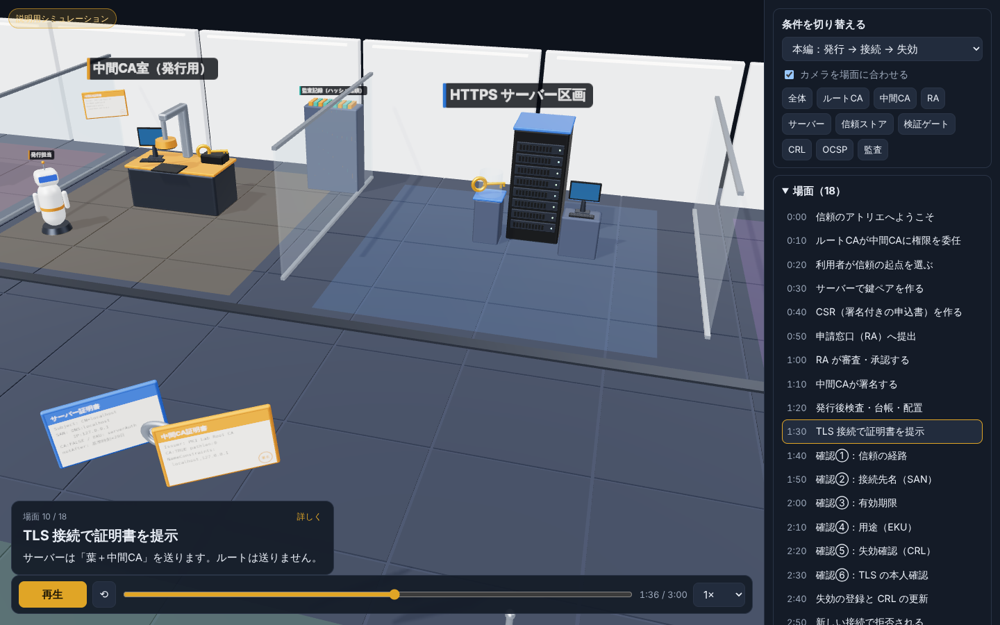
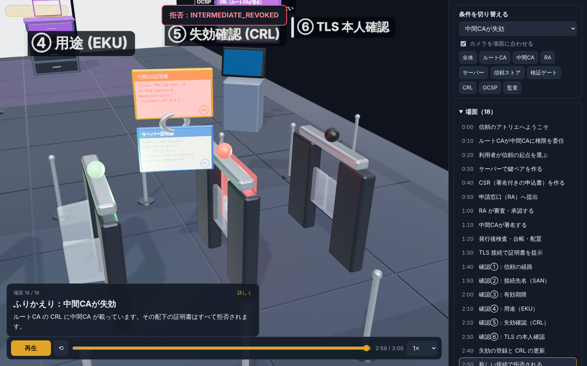
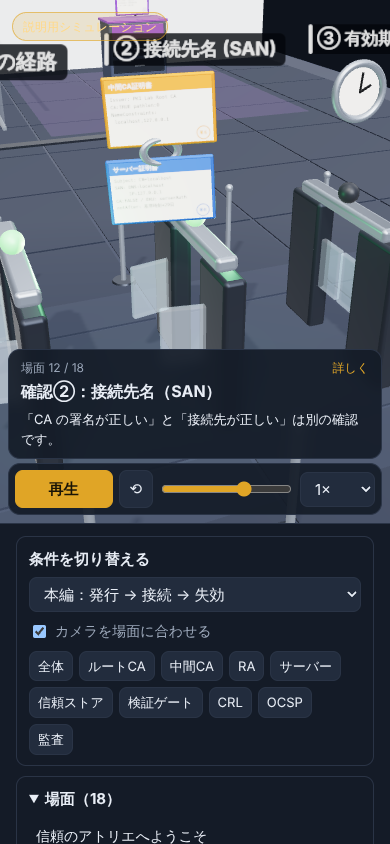

# 証明書の発行・検証・失効を three.js の3Dアニメで見る

> **2026-10-09 Round 4更新：** 実装契約は[運用・復旧手順書](../../docs/06_operations.md)を参照。失効要求と公開完了は別イベント。失効確認の設定と観測も区別する。`check`は `problems` と修復可能な `actions` を分離し、CRL欠落を接続許可へ読み替えない。復元の準備判定と再開承認は別で、再開時に元環境を識別・停止して新しさを再確認する。本文の過去のテスト件数は当時の記録であり、現在の件数はCIログを正本とする。

## ― 学習空間「信頼のアトリエ」の作り方

前回は、自分だけの認証局（CA）を要件定義・基本設計・詳細設計の順に設計し、実装まで行いました。

ただ、PKI（公開鍵基盤）の説明は文字と表だけだと、どうしても頭に入りにくいものです。

- 秘密鍵はどこにあって、どこへも行かないのか
- 証明書は誰から誰へ渡るのか
- ブラウザは何を、どの順番で確かめているのか
- 失効した証明書は、どこで止められるのか

そこで今回は、この流れを **three.js の3D空間とアニメーション** で見られる教材「信頼のアトリエ」を作りました。


> **ポイント**
> 3D空間では、**「CAが発行する場所（奥）」**と**「利用者が信頼を判断する場所（手前）」**をわざと離して配置しています。証明書を発行することと、それが信頼されることは別の判断だからです。

---

### 目次

1. 空間の構成
2. 3Dモデルの表現ルール
3. 180秒・18場面のアニメーション
4. 9つの条件を切り替えて比べる
5. ラボの「実測」とつなげる
6. three.js での実装
7. ブログへの埋め込み方
8. 正確に伝えるために気をつけたこと
9. まとめ

---

## 1. 空間の構成

28m × 20m の屋根のない展示施設として作りました。上から見下ろすと、全部の区画を一度に見渡せます。

```
                    発行・運用側（奥）
 ルートCA室 ── 中間CA室 ─ 監査 ── サーバー ── 失効情報(CRL)
                                                     OCSP 比較
   申請窓口(RA)        利用者端末＋信頼ストア
                                 └→ 検証ゲート①〜⑥ → 出口
                    利用側（手前）
```

| 区画 | 置いてあるもの | ここで学ぶこと |
|---|---|---|
| ルートCA室 | 金庫・可動扉・鍵固定台 | ルート鍵は持ち出さず、中間CAに権限を委任する |
| 中間CA室 | 署名コンソール・押印ヘッド | 承認された内容にだけ署名する |
| 申請窓口（RA） | カウンター・端末・審査ランプ | CSRの確認と、名前を使う権利の確認は別 |
| HTTPSサーバー | サーバーラック・鍵ケース | 秘密鍵はサーバーに残る |
| 利用者端末 | モニター・信頼ストア | 信頼するルートは利用者が選ぶ |
| 検証ゲート | 6基のゲート | ブラウザが確認する項目を1つずつ見せる |
| 失効情報 | CRLキャビネット・一覧ボード | 失効の登録 → 配布 → 確認 |
| 監査 | 記録キャビネット | 承認・台帳・証明書・失効の照合 |

検証ゲートは、ネットワーク上に別の装置があるわけではありません。**ブラウザ（利用者端末）の中で行われる確認を、見学できる大きさに拡大した比喩**です。

---

## 2. 3Dモデルの表現ルール

モデルは40項目に整理し、すべて three.js のコードで生成しています（外部の3Dファイルや画像は使っていません）。

| 見た目 | 意味 |
|---|---|
| 金の鍵 | 秘密鍵（象徴）。**どの場面でも一度も動かない** |
| 青い多面体 | 公開鍵 |
| 赤いカード | ルートCA証明書 |
| 橙のカード | 中間CA証明書 |
| 青いカード | サーバー証明書（葉） |
| 緑のフォルダー | CSR（署名付きの申込書） |
| 紫のボード | CRL（失効リスト） |
| ゲートのランプ | 黄＝確認中、緑＝合格、赤＝拒否、橙＝判定不能 |

証明書カードの表面には、Subject・SAN・CA:TRUE/FALSE などの主要な項目を描いています。


> 「秘密鍵は動かない」は見た目の約束だけでなく、自動テストでも確認しています。アニメーションの軌跡を持つ物体の中に、秘密鍵が含まれていないことを検査しています。

---

## 3. 180秒・18場面のアニメーション

| 時間 | 場面 | 何が起きるか |
|---|---|---|
| 0:00 | 全体像 | 発行する側と信頼する側を見渡す |
| 0:10 | ルートCAが中間CAに権限を委任 | 金庫の扉が開き、中間CA証明書だけが出てくる |
| 0:20 | 利用者が信頼の起点を選ぶ | ルート証明書が「別の経路」で信頼ストアへ |
| 0:30 | 鍵ペアを作る | サーバーの金の鍵が光り、公開鍵だけが出てくる |
| 0:40 | CSRを作る | 公開鍵が申込書に入る |
| 0:50 | RAへ提出 | CSRが窓口へ運ばれる |
| 1:00 | 審査・承認 | 審査ランプが点き、承認バッジが付く |
| 1:10 | 中間CAが署名 | 押印ヘッドが下り、サーバー証明書が生まれる |
| 1:20 | 発行後検査・台帳・配置 | 監査棚が光り、証明書がサーバーへ |
| 1:30 | TLS接続で証明書を提示 | **葉＋中間CA**が利用者へ（ルートは送らない） |
| 1:40 | 確認① 信頼の経路 | 署名をたどって信頼ストアのルートに着くか |
| 1:50 | 確認② 接続先名（SAN） | 接続したい名前が SAN にあるか |
| 2:00 | 確認③ 有効期限 | 今が有効期間の中か |
| 2:10 | 確認④ 用途（EKU） | サーバー認証用か |
| 2:20 | 確認⑤ 失効確認（CRL） | 葉と中間CAが CRL に載っていないか |
| 2:30 | 確認⑥ TLSの本人確認 | サーバーが秘密鍵で CertificateVerify に署名できたか |
| 2:40 | 失効登録とCRL更新 | CRLボードが新しい版に変わり、配布される |
| 2:50 | 新しい接続で拒否 | 失効ゲートで止まり、赤い遮断パネル |



最後の2場面は、前回の実験で一番大事だった結果を表しています。

> CAで失効させても、**利用側が新しいCRLを確認しなければ接続できてしまう**。

そのため「CRLを更新した瞬間に既存の接続が切れる」演出にはせず、**新しい接続で新しいCRLを確認した結果、拒否される**という流れにしています。


---

## 4. 9つの条件を切り替えて比べる

右側のメニューで条件を変えると、証明書がどのゲートで止まるかが変わります。

| 条件 | 止まる場所 | 結果コード |
|---|---|---|
| 本編（発行→接続→失効） | 最後の新規接続で⑤ | `LEAF_REVOKED` |
| 正常な証明書 | 止まらない | `OK` |
| 信頼していないルート | ① 信頼の経路 | `UNTRUSTED_ANCHOR` |
| 接続先の名前が違う | ② SAN | `SAN_MISMATCH` |
| 証明書の期限切れ | ③ 有効期限 | `CERT_EXPIRED` |
| サーバー用途ではない | ④ EKU | `WRONG_EKU` |
| サーバー証明書が失効 | ⑤ 失効確認 | `LEAF_REVOKED` |
| 中間CAが失効 | ⑤（中間CAのカードが赤く光る） | `INTERMEDIATE_REVOKED` |
| CRLが古く確認できない | ⑤（橙色） | `CRL_EXPIRED`（判定不能） |



**「CRLが古い」は「失効している」とは違います。** 「失効状態を確認できない」という別の結果なので、ランプは赤ではなく橙にしています。そのうえで、ラボの方針として接続は許可しません。

この結果コードは、前回作ったラボのコマンド（`pkilab.py verify` / `client`）が返すコードとそろえています。

---

## 5. ラボの「実測」とつなげる

3Dアニメの再生は、あくまで**説明用のシミュレーション**です。画面左上にも常に「説明用シミュレーション」と表示しています。

一方で、前回のラボには、実際に行った処理を書き出す機能があります。

```bash
python3 lab/pkilab.py export-events
# → lab/work/exports/events.json
```

この JSON を3D画面の「実測イベント」から読み込むと、実際に起きた処理（発行・検証・失効・TLS接続など）が一覧で表示され、対応する場面に「実測」の印が付きます。

ただし、ラボが記録しているのは「検証全体の結果」です。経路・名前・失効といった**段階ごとの結果は計測していない**ので、段階別の「実測」としては出しません。失効確認をしなかった検証には「失効確認なし」と表示します。また、`measured` が `true` でない記録は実測として扱いません（ファイルが本当にラボで作られたかどうかは、ブラウザ側では確認していません）。

出力する JSON には、秘密鍵・パスフレーズ・証明書本体を含めません。シリアル番号などもハッシュの一部に置き換えています。3D画面側でも、`PRIVATE KEY` などの文字列を含むファイルは読み込まないようにしています。

> **シミュレーションと実測を混ぜない**
> 取得していない内部処理を「実測」として見せたり、証明書ファイルの検証成功を「TLS接続の成功」として表示したりしないように、両者をはっきり分けています。

---

## 6. three.js での実装

### ファイル構成

```
viz/
├── index.html          画面（importmap で three.js を読み込む）
├── css/style.css
├── js/
│   ├── lesson.js       場面・条件・動き（描画に依存しない）
│   ├── world.js        3Dモデルと空間の生成
│   └── main.js         描画・カメラ・UI
├── vendor/three/       three.js r169（同梱。CDN不要）
├── data/sample-events.json  ラボの実測イベント
└── tests/              ロジック試験・ブラウザ描画確認
```

### 設計のコツ：ロジックと描画を分ける

一番大事にしたのは、**「時刻 t のとき何がどこにあるか」を計算する部分（lesson.js）を、three.js から完全に切り離す**ことです。

```js
// lesson.js（three.js を使わない）
const st = lessonState(t, 'intermediateRevoked');
st.tokens.leaf      // → サーバー証明書の位置 [x, y, z]
st.gates[4].state   // → 'fail'
st.result           // → { verdict: 'REJECT', code: 'INTERMEDIATE_REVOKED' }
```

```js
// main.js（three.js 側は反映するだけ）
const st = lessonState(ui.t, ui.scenario);
for (const [name, obj] of Object.entries(world.tokens)) {
  const v = st.tokens[name];
  obj.visible = !!v;
  if (v) obj.position.set(...v.p);
}
```

こうすると、Node.js だけで次のような**教材として正しいか**のテストが書けます。

- 秘密鍵が移動していないか
- ルート証明書がサーバーから届く表現になっていないか
- 「CRLが古い」が「失効」と表示されていないか
- 失敗した条件で、後ろのゲートを評価していないか

### 証明書の移動はキーフレーム

各トークン（証明書・CSRなど）は「何秒にどこにいるか」のキーフレームで動かしています。移動中は放物線で持ち上げて、運ばれている感じを出しています。

```js
tracks.csr = [
  kf(40, pos('server')),
  kf(50, pos('server')),
  kf(57, pos('ra'), { move: true, arc: 2.4 }),          // サーバー → RA
  kf(70, pos('ra')),
  kf(74, pos('intermediate'), { move: true, arc: 2.6 }), // RA → 中間CA
  kf(78, null, { hide: true }),
];
```

### モデルはコードで作る

外部の 3D ファイルを使わず、`RoundedBoxGeometry`（角の丸い箱）・円柱・トーラスなどを組み合わせています。証明書カードの文字は、Canvas に描いてテクスチャにしています。

```js
function makeCertCard(kind) {
  const body = rbox(0.5, 0.32, 0.025, mat, 0.02);      // 角の丸いカード
  const face = new THREE.Mesh(
    new THREE.PlaneGeometry(0.47, 0.295),
    new THREE.MeshStandardMaterial({ map: cardFace(title, rows, accent) }) // Canvasで描いた表面
  );
  ...
}
```

床タイル140枚は `InstancedMesh` で1回の描画にまとめています。照明は `RoomEnvironment` の環境マップと、影付きの平行光源です。

### CDN に頼らない

three.js は `vendor/` に同梱し、importmap で読み込んでいます。CDN が使えない環境でも、静的ファイルを置くだけで動きます。

```html
<script type="importmap">
{ "imports": {
    "three": "./vendor/three/three.module.js",
    "three/addons/": "./vendor/three/addons/" } }
</script>
```

### 動かし方

```bash
cd viz
python3 -m http.server 8765 --bind 127.0.0.1
# ブラウザで http://127.0.0.1:8765/ を開く
```

`index.html` をダブルクリックで開くと、ES モジュールの制限で動きません。ローカルサーバー経由で開いてください。

| 操作 | 方法 |
|---|---|
| 再生・一時停止 | ボタン、またはスペースキー |
| 前後の場面へ | ← → キー、または場面リスト |
| 視点 | ドラッグで回転、ホイールでズーム、区画ボタンで移動 |
| 条件切替 | 右上のメニュー |

---

## 7. ブログへの埋め込み方

`viz/` フォルダーをそのままサーバーにアップロードすれば動きます。記事には iframe で埋め込めます。

```html
<iframe
  src="/awslearn/practical/ca-atelier/?embed=1&autoplay=0"
  width="100%" height="560" style="border:0;border-radius:12px"
  title="CAの発行・検証・失効を3Dで見る" loading="lazy" allowfullscreen>
</iframe>
```

| パラメーター | 効果 |
|---|---|
| `embed=1` | 右側のパネルを隠す |
| `autoplay=0` | 自動再生しない |
| `scenario=sanMismatch` | 条件を指定して開く |
| `t=140` | 指定した秒から開く |

スマートフォンでは、3D画面の下にメニューが並ぶレイアウトになります。



---

## 8. 正確に伝えるために気をつけたこと

3Dは分かりやすい反面、間違った印象も与えやすい表現です。次の点は意識して作りました。

| よくある誤解 | この教材での表現 |
|---|---|
| CAが証明書を暗号化している | 押印は**電子署名のたとえ**だと明記 |
| サーバーからルート証明書が届いて信頼される | ルートは利用者が**別経路**で信頼ストアに入れる |
| CAが通信を暗号化・中継している | 通信の鍵は端末同士で共有。CAは関与しない |
| CNが一致すれば名前の確認はOK | SAN で確認し、CN は見ない |
| CRLを更新すれば即座に接続が切れる | **新しい接続**で確認したときに拒否される |
| 確認できない＝失効 | 「判定不能」として別に表示 |
| ゲートの順番＝ブラウザ内部の実行順 | 並び順は説明用と明記 |

---

## 9. まとめ

- PKI の流れを、**場所（発行側と利用側）と物の移動**で見せると理解しやすい
- 秘密鍵は動かない、ルートは別経路、失効は新しい接続で効く ― を3Dの約束として固定した
- 時刻から状態を計算するロジックを描画から切り離し、**教材の正しさを自動テスト**できるようにした
- 3Dはあくまで説明用。ラボの**実測イベント**を読み込んで、両者を区別して見られるようにした
- 条件を切り替えると、証明書カードの用途・CRL の発行者と失効項目・信頼ストアの中身も同じデータから切り替わる

ソースコードは GitHub で公開しています。

- リポジトリ：`https://github.com/kurumonn/CA`
- 3D教材：`viz/`
- CAラボ：`lab/`
- 設計書：`docs/`

---

### 既知の制約

- これはコードで作った軽量の教材プロトタイプです。モデルは基本形状の組み合わせで、手作業のスカルプト・テクスチャのベイク・LOD はなく、AAA 品質のモデル納品ではありません。
- 全体表示で約11万三角形です。Chromium（ソフトウェア描画）で表示を確認していますが、実機GPUでのフレームレートは測定していません。
- OCSP は比較展示のみで、ラボには OCSP レスポンダーを実装していません。
